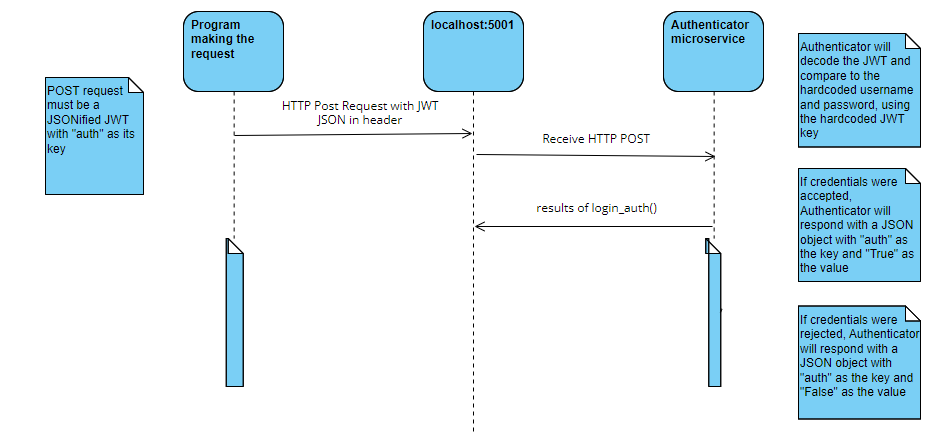

Login Authenticator Microservice

Uses POST requests to receive a JSONified JWT into a Flask application (auth.py) then authenticates the user credentials.

**How to request and receive data**
1. Set a key that the JWT package will use to encrypt/decrypt the tokenized username and password. Best practice is to use a randomly-generated key. This key must match between the server and the client.
2. POST a JSON string in the form {"auth": \<the JWT token>} to http://127.0.0.1:5001/auth
   a. If using Python, you can use the requests package:
   ```
   import requests
   login = requests.post('http://127.0.0.1:5001/auth', json=json.dumps(jwt_dict)).json()['auth']
   ```
   The variable 'login' will then contain the response sent back by the auth server.

**UML Sequence Diagram**

